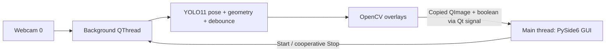

<div align="center">

# VERTEBRATE
### Live pose. Clear signals. Local execution.


[](LICENSE)

A focused webcam application that turns human pose geometry into visible fall-posture alerts.

</div>

---

## One file. Two threads. A live view.

`app.py` provides a dark desktop interface, green/red skeleton overlays,
Start/Stop controls, and a flashing **FALL DETECTED** banner. Inference runs
locally on the CPU. The application does not upload or record webcam footage.



The worker owns the camera and model; the main thread owns every widget.
Only one frame signal may be pending, preventing an image backlog.
Camera release happens in the worker during shutdown.

## The heuristic

Each detected person matches when either condition holds:

```text
width / height > 1.2
              OR
(shoulder_5.y + shoulder_6.y) / 2 > (hip_11.y + hip_12.y) / 2 + 20 pixels
```

Image Y increases downward. Missing/zeroed spine landmarks disable the spine
check; the bounding-box check remains available. Red overlays indicate matching
posture; green indicates the rule did not match.

The alert requires **five consecutive processed frames** with at least one
matching person. A nonmatching frame clears the counter. This scene-wide
debounce does not establish person identity or a fixed duration in seconds.
There are no historical baselines, ByteTrack IDs, or legacy state machines.

## Quickstart · Windows 11 x64

Use **Python 3.12** and a webcam. From the repository directory:

```powershell
py -3.12 -m venv .venv
.\.venv\Scripts\python.exe -m pip install -r requirements.txt
.\.venv\Scripts\python.exe -m pip check
```

Keep an existing working `.venv` if you already have one. Install only the listed
OpenCV distribution; do not add headless or contrib variants alongside it.

Place `yolo11n-pose.pt` beside `app.py` or inside `models/`. For a fresh setup,
download the [official weights](https://github.com/ultralytics/assets/releases/download/v8.3.0/yolo11n-pose.pt)
once and save them in either location. Missing weights are never downloaded
automatically. Prepare dependencies and weights before offline use.

```powershell
.\.venv\Scripts\python.exe app.py
```

Click **Start camera**. Click **Stop** to release it. If camera 0 cannot open,
close other camera applications and enable Windows desktop-app camera access.
A stalled driver is reported while the window remains responsive.

## Workspace after cleanup

```text
app.py                       Standalone application
requirements.txt             V1 CPU dependencies
requirements-win-cpu.lock    Preserved historical full environment lock
LICENSE                      MIT grant for original code
THIRD_PARTY_NOTICES.md        Dependency and model license scope
models/                      Local weights and provenance
data/videos/                 Preserved local footage; Git-ignored
runtime/                     Generated local settings; Git-ignored
.archive/                    Legacy backups; Git-ignored
```

`requirements.txt` is the V1 installation path. The historical lock includes
legacy/test packages and remains available for reproducing the old environment.
Weights and videos stay on disk and are excluded from new Git commits.

## Interpretation

This detects posture, not its cause. Deliberately lying down, camera rotation,
occlusion, and pose errors can affect alerts. The 20-pixel threshold depends on
image scale. Development observations are not an independently validated
accuracy guarantee.

**Local demo — no external emergency dispatch.**

## License

Original project code: **MIT**, copyright **Advaet Chintakunta**. See [LICENSE](LICENSE).

Ultralytics software and weights have separate **AGPL-3.0** terms. The MIT grant
does not relicense them or make the combined application MIT-only. Ultralytics
describes AGPL requirements for the combined project or a separate enterprise
license in its [licensing guidance](https://www.ultralytics.com/license).
Retain applicable upstream notices. See [third-party notices](THIRD_PARTY_NOTICES.md).
